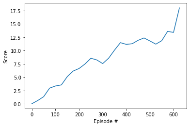

# Report

Thanks to https://github.com/ostamand for laying the groundwork on getting the Github repo working with Unity.
Thanks to grokking-deep-reinforcement-learning for code in the dueling network.

DQN +

- Priority Replay
- Double DQN
- Dueling DQN
- Polyak Averaging
- Average score over 100 episodes is 16.93.
- Environment is solved in approx. 550 episodes (average score > 13.0 for 100 episodes)

Q-Network uses batch normalization with ReLu activation function at each hidden layer.

For exploration, epsilon is linearly decayed from an inital to a final value in a given number of episodes.

The hyperparameters of the model are:

| Parameter         | Value   | Description                 |
| ----------------- | ------- | --------------------------- |
| Replay start size | 200     | Min Replay memory to use    |
| Replay size       | 10 000  | Replay memory max size      |
| Batch size        | 50      | Number of samples per batch |
| Update every      | 4       | Learn from replay every #.  |
| Gamma             | 0.99    | Discount rate               |
| Hidden layers     | [36,36] | Q-Network                   |
| Tau               | 0.01    | Soft update rate            |
| Learning rate     | 0.00025 |

while the training characteristics are:

| Parameter           | Value | Description                                 |
| ------------------- | ----- | ------------------------------------------- |
| Episodes            | 1800  | # of episodes                               |
| Steps               | 1000  | Maximum # of steps per episode              |
| Final score         | 13.00 | Average score after training (100 episodes) |
| # Episodes to solve | 632   | Average score of 13 (100 episodes)          |
| Initial epsilon     | 1.0   |
| Final epsilon       | 0.04  |

The figure below illustrates the average score during training.

The Agent could be improved by performing a Hyper parameter optimization. Or incorporating additional upgrades to DQN such as distributional value networks, or N step returns.
